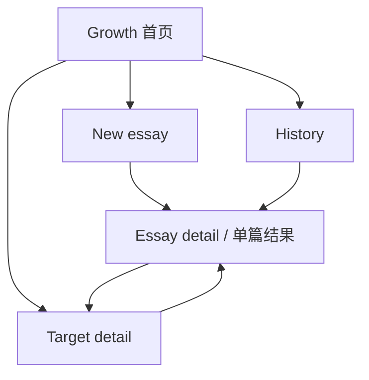

# DEEA Page Architecture v0.1

状态：页面关系提案｜2026-09-23

## 导航决策

**Growth 为首页**，即使没有作文也展示清晰的空状态和“写第一篇议论文”按钮。顶部一级导航为 **Growth / New essay / History**。这样新用户仍能一步找到输入区，已使用的用户则首先看到当前目标与后续观察。现有 New essay 页面和原文编辑区保留为独立工作区。

| 入口 | 首要问题 | 主要动作 |
| --- | --- | --- |
| Growth | 我现在重点练什么，后续有没有变化？ | 查看目标证据、开始新作文、进入目标详情。 |
| New essay | 我怎样提交下一篇议论文？ | 输入题目与正文、分析、核查候选、保存。 |
| History | 我之前写过什么，判断依据在哪里？ | 按日期浏览、打开原文、管理比较范围、删除。 |

## 视图结构

`Essay detail` 和 `Target detail` 可先实现为应用内详情视图，无须立刻引入路由。每个详情保留返回来源与返回主导航的路径。完整 lemma 表作为 Essay detail 内的“详细数据”，不占主导航。

## 关键跳转与状态

1. **首次进入**：Growth 空状态解释仅保存于当前浏览器，引导 New essay；用户填写并分析，审核候选后保存，回到 Growth 可看第一篇数据，但“长期趋势”显示样本不足。
2. **建立基线**：从 Growth 或 History 打开某词的相关作文与上下文；达到足够同类样本且经人工核查后，从候选设目标。三篇作为可讨论的起始建议，少于三篇也可记录目标但不能称为稳定基线。
3. **后续写作**：New essay 保存后，Growth/Target detail 显示它在目标之后的序号。+1 仅即时响应；+3/+5 才呈现相应窗口，仍展示每篇证据。
4. **删除或排除**：History 删除前提示会影响哪些目标观察；删除或改变纳入资格后重算篇序和窗口。若删除目标锚点，要求重新锚定或将目标暂置“待处理”。
5. **旧数据**：现存记录没有文体字段；History 提示逐篇确认“议论文 / 不参与比较”，未经确认的记录可看原文和单篇分析，不进入 Growth 趋势。

## 教师与学习者

Demo 使用**同一界面**，由一名写作者在一个浏览器中保存作文。目标详情提供教师可编辑的教学提示和替代表达，学生也可自行使用；界面不暗示已验证教师身份或支持多人权限。后续若开展班级管理，再拆分角色和学生空间。

## 数据不足与解释文案

- 无作文：`写第一篇议论文，开始建立自己的表达记录。`
- 只有 1–2 篇：`可查看重复出现的词；尚不足以判断长期依赖。`
- 未核查词性或语义机会：`候选待核查，无法计算同组表达占比。`
- +1 篇：`出现即时变化；继续观察下一些作文。`
- 目标后不足 +3/+5：展示实际篇数与空窗口，不预告“已掌握”。
- 删除后数据不足：清除不再有证据支持的状态，保留目标并提示重新观察。

关联文档：[功能树](./DEEA_FEATURE_TREE_CN.md) · [中文 PRD](./DEEA_PRD_CN.md)
