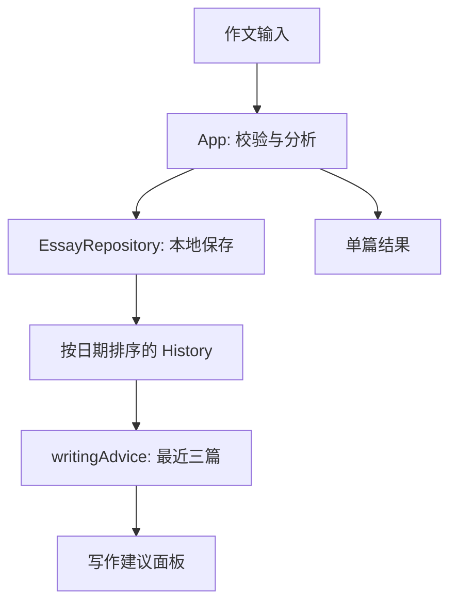

# DEEA v0.2 技术设计（中文）

**状态**：对应 [PR #4](https://github.com/gwx4399-cell/coca-word-frequency-tool/pull/4) 草稿分支的实际实现｜2026-09-23。  
**运行环境**：Vite + React + TypeScript，纯浏览器分析与 `localStorage`；无服务器、AI API 或遥测上传。

## 1. 组件与数据流



| 文件 | 责任 |
| --- | --- |
| `src/App.tsx` | 表单状态、`Analyze and save`、错误反馈、History、单篇表格和建议展示。 |
| `src/storage/essayRepository.ts` | 校验、内容幂等、标题冲突、读写/删除和最新优先排序。 |
| `src/analysis/tokenize.ts` | 英文 token 提取和停用词集合。 |
| `src/analysis/coca.ts` | 读取 CSV，按 lemma 汇总不同词性记录并派生内部排名。 |
| `src/analysis/analyzeEssay.ts` | 轻量词形还原、lemma 计数、observed forms、内部 COCA 对照。 |
| `src/analysis/writingAdvice.ts` | 从最近三篇计算重复线索，配人工撰写的练习提示。 |
| `src/types/{essay,analysis}.ts` | 作文与单篇分析的数据类型。 |

入口读取 `data/COCA_WordFrequency_top5000.csv?raw`，在浏览器里建立 lemma Map。`EssayRepository.listEssays()` 返回按 `writtenAt` 降序、再按 `createdAt` 降序、最后按 ID 排序的作文；`App` 以此生成 History 和建议。原文保存在 `deea.essays.v1` 键下，分析结果**不持久化**：打开历史时用当前分析器重算。新增的写作建议也不存入浏览器，避免删除或增加作文后沿用过期结论。

## 2. 分析并自动保存

`handleAnalyze` 先调用 `validateEssayInput`（标题、真实日历日期、非空正文），再对正文执行 `analyzeEssay`，最后调用 `repository.createEssay` 并刷新本地历史。成功提示标题已保存；存储报错时保留可见的单篇分析，同时提示未保存。正文被修改后清除旧分析；标题或日期修改后需要再次点击按钮才能将当前表单作为新记录提交。

仓储层先按标题、日期、题目和完整正文比对：**完全一致返回原记录**。随后将标题 `trim()` 并按英语区域小写比较；若同名但内容不同，抛出 `EssayValidationError({title})`。因此重复点击不会增加历史数量，而同名新作文须改标题。对历史既有重复标题不做迁移或静默删除。

## 3. 最近三篇建议算法

输入为最新优先的 `EssayRecord[]` 与 COCA lemma Map；少于三篇返回 `null`。取 `essays.slice(0, 3)`，对每篇调用 `analyzeEssay`，然后只检查八个固定示例 lemma（见 [PRD](./DEEA_PRD_CN.md)），且必须在 COCA Map 中。每个词记录其出现的作文标题与次数、出现篇数、总次数、单篇最高次数。

```text
candidate = max_count_in_one_essay >= 3 AND appearing_essays >= 2
if any candidates: show up to 3 candidates
else: show up to 3 example words appearing in >= 2 essays, labeled observation
if no such words: show a general practice prompt
```

候选排序依次为出现篇数降序、总次数降序、lemma 字母序。建议来自本地固定文本，涉及多个备选表达时强调先核对原句。COCA 中某 lemma 可有形容词记录，但**没有 token 级词性判别**；同义词也没有按语境自动生成。这里计算的是可复核的重复线索，并非语义组 >50% 的集中度。

`App` 通过 `useMemo([essays, cocaEntries])` 计算建议。保存与删除会更新 `essays`，因此第三篇完成时建议立即出现；删除到少于三篇会消失；刷新时 `listEssays()` 从旧键恢复并重新计算。History 仍能看到原题和原文，但建议卡片本身只列作文标题和次数，用户需进 History 核对语境。

## 4. 显示、存储与隐私边界

分析对象仍具有 `lexicalTokenCount`、`uniqueLemmaCount`、`cocaCoveragePct`、`ratePer100Words`、`derivedLemmaRank` 等字段，以保持既有分析和测试能力；**v0.2 UI 不显示它们**。可见表格保留 `observedForms` 与本篇 lemma 次数。COCA 数据为有限的 Top 5,050 源记录，不代表全部语料；参见仓库 `NOTICE.md`。

未引入新存储键或迁移，已有 `deea.essays.v1` 记录可直接读取；浏览器清除本地数据会丢失作文。没有作文原文的联网请求，也没有埋点或 AI 模型调用。GitHub Pages 工作流仅在 `main` 推送时部署；此 PR 在草稿分支上**不会自动成为公开运行版本**。

## 5. 验证与可复现性

在项目根目录运行：

```bash
npm ci
npm test
npx tsc --noEmit
npm run build
```

本轮记录：6 个测试文件、30 个测试通过；类型检查和生产构建通过。关键覆盖为重复提交/标题冲突、第三篇触发与刷新、删除后撤销建议、候选与弱复现分级、无命中回退。构建提示主 JS 包较大，主要由于频率 CSV 随客户端打包；并非本轮的性能优化目标。

## 6. 已知限制与下一步工程接口

- 所有已保存作文都会进入最近三篇；尚无议论文文体字段与作者隔离。要做严格同文体纵向比较，先扩展 `EssayRecord` 与历史迁移/确认流程。
- 词形还原是确定性启发式，未消除词性歧义；若扩充候选库，应先加入上下文核查或人工确认。
- 当前目标仅是“阅读建议”，没有目标 ID、干预锚点或 +1/+3/+5 状态。后续应单独建模并保留分析版本与人工判断。
- 建议可由纯函数生成，适合作为未来规则/语义服务的可替换层；接入 AI 时须另设计数据授权、评估集、错误回退和人工复核，不能将现有固定提示称为 AI 反馈。

**关联**：[PRD（中文）](./DEEA_PRD_CN.md) · [Technical design (English)](./DEEA_TECHNICAL_DESIGN_EN.md) · [文档索引](../../README.md)
