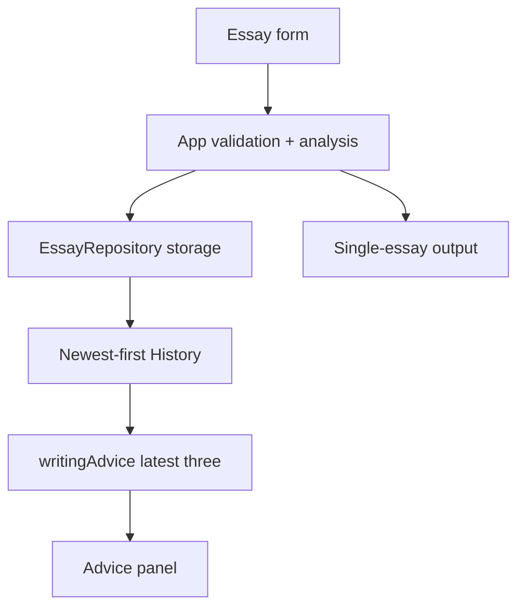

# DEEA v0.2 Technical Design

**Status:** Describes the code merged into `main` via [PR #4](https://github.com/gwx4399-cell/coca-word-frequency-tool/pull/4); this document is proposed in a follow-up documentation PR, dated 2026-09-23.  
**Runtime:** Vite, React and TypeScript; browser-only computation and `localStorage`. No backend, AI API or telemetry upload.

## 1. Architecture and ownership



| Source | Responsibility |
| --- | --- |
| `src/App.tsx` | Form state, analyze-and-save action, feedback, history, table and advice rendering. |
| `src/storage/essayRepository.ts` | Validation, idempotency, title uniqueness, persistence, deletion and ordering. |
| `src/analysis/tokenize.ts` | English token extraction and stop-word list. |
| `src/analysis/coca.ts` | Parse CSV and aggregate records with the same lemma across parts of speech. |
| `src/analysis/analyzeEssay.ts` | Lightweight lemmatization, lemma counts, observed forms and internal COCA lookup. |
| `src/analysis/writingAdvice.ts` | Evidence from the latest three essays plus curated practice prompts. |
| `src/types/{essay,analysis}.ts` | Record and single-essay analysis contracts. |

The COCA-derived CSV is bundled via Vite's `?raw` import and parsed into a lemma Map in the browser. `EssayRepository.listEssays()` sorts by writing date descending, then creation timestamp descending, then ID. Originals are stored under `deea.essays.v1`. Analysis and advice are recomputed rather than persisted, so a deletion cannot leave an outdated advice snapshot.

## 2. Submission and title uniqueness

`handleAnalyze` validates nonempty title and text and a real calendar date, computes `analyzeEssay`, calls `createEssay`, then refreshes the state from storage. A successful save is confirmed in the UI. If storage fails, the visible single-essay analysis may remain but the error says it was not saved. Editing the text clears the prior analysis; submitting changed metadata requires another click.

The repository first checks for a record with the same normalized title, date, task and exact original text; it returns that record for idempotent submission. Otherwise it compares trimmed titles case-insensitively (English locale). A conflict raises `EssayValidationError({title})`; existing historical duplicates are left untouched.

## 3. Advice function

`getWritingAdvice(essays, cocaEntries)` returns `null` below three saved essays. With at least three, it analyzes `essays.slice(0, 3)`, considering eight curated lemmas that exist in the COCA map. For each, it records title/count pairs, total count, number of essays with occurrences and highest single-essay count.

```text
candidate := highest single-essay count >= 3 AND present in >= 2 of 3 essays
if candidates exist: rank and show at most 3
else: rank words present in >= 2 essays as observations; show at most 3
if neither exists: show a general practice prompt
```

Ranking is by number of essays, then total count, then lemma alphabetically. The meanings and possible alternatives are manually authored in code. There is no contextual POS tagging, semantic equivalence classifier or semantic-opportunity denominator. The result is a prompt to review original sentences, not a dependency diagnosis.

`App` memoizes this function on `[essays, cocaEntries]`. Saving and deleting update `essays`, which updates the panel immediately. Refresh restores records from the same local key. A card lists titles and counts; original text is accessible from History, not quoted in the card itself.

## 4. UI and privacy contract

Existing analysis types still contain lexical-token count, unique-lemma count, COCA coverage, per-100-word rate, derived rank and aggregate frequency. **v0.2 stops presenting these as user-facing quality signals**; observed forms and per-essay counts remain visible. The bundled CSV covers a limited Top 5,050 source records; see `NOTICE.md` for attribution and scope.

No new storage key or migration is introduced; existing browser history remains readable. No essay text is uploaded, no analytics event is sent and no AI model is called. The GitHub Pages workflow runs on pushes to `main`; this document does not claim the public deployment has been checked.

## 5. Verification

Run from the repository root:

```bash
npm ci
npm test
npx tsc --noEmit
npm run build
```

Recorded result for this iteration: 30 tests across six files passed; type check and production build passed. Cases include identical resubmission, title conflict, third-essay trigger, refresh, deletion, strong/weak recurrence and the no-match fallback. The large client bundle warning remains because the frequency CSV is included; optimizing that bundle is outside this iteration.

## 6. Constraints and extension points

- All saved essays enter the rolling three-essay window. Genre and author IDs require an explicit data-model extension before controlled longitudinal claims.
- Lemmatization is heuristic and may misclassify ambiguous forms. Larger candidate dictionaries need contextual or human verification.
- There is no persistent target, intervention anchor or +1/+3/+5 outcome state. Model these separately from automatic evidence and preserve human judgments when analysis changes.
- The advice function is a replaceable pure layer. Any future AI integration needs a consent, evaluation, failure-handling and human-review design; the current prompts must not be represented as AI-generated feedback.

**Related:** [Product requirements](./DEEA_PRD_EN.md) · [技术设计（中文）](./DEEA_TECHNICAL_DESIGN_CN.md) · [Documentation index](../../README.md)
