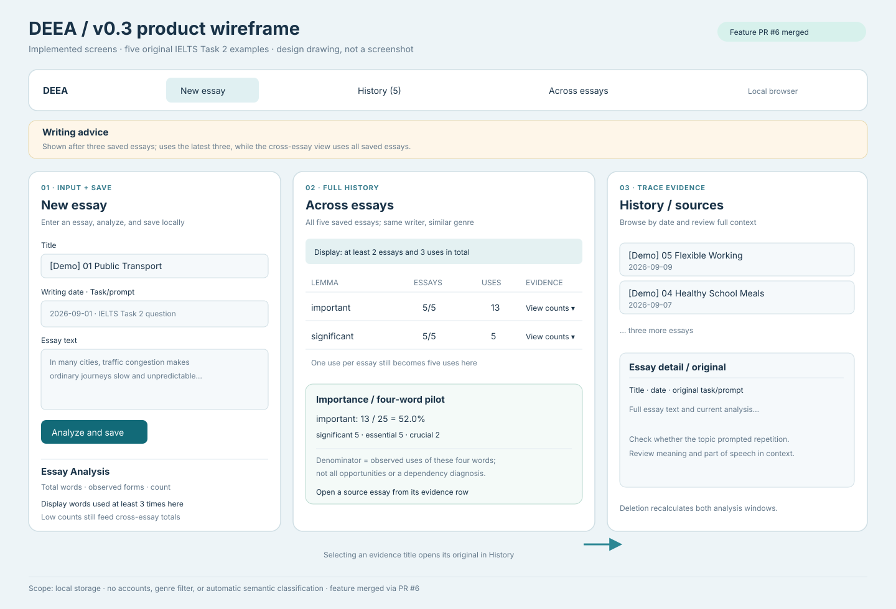

# DEEA v0.3 Product Design Notes

**Status:** A drawing of screens already merged through [feature PR #6](https://github.com/gwx4399-cell/coca-word-frequency-tool/pull/6). The drawing itself is on a follow-up branch pending review; no public deployment claim. **Date:** 2026-09-23.

This is a **structural wireframe**, not a screenshot or an interactive prototype. Its numbers come from [five original IELTS Task 2 demonstration essays](../../../data/demo/IELTS_TASK2_FIVE_ESSAYS.md) and assume that these five are the browser's **entire saved history**.

## 1. Screens and evidence path

| Implemented area | User question | Action and state |
| --- | --- | --- |
| New essay | Which words recur in this essay? | Enter title, writing date, prompt and original text. Analyze and save together; show only words used three or more times in the single-essay table while retaining observed forms. |
| Across essays | In how many essays did a word occur, and how many times overall? | Aggregate all saved essays by lemma; list words found in at least two essays and at least three total uses. Expand per-essay date, count, observed forms and a link to the original. |
| History | What was the original context? | Read the essay and task, review topic effects and meaning; deletion recalculates results. |
| Shared Writing advice | What might be worth practicing in the latest three essays? | Appears after the third saved essay, with its separate three-essay window clearly distinguished from the full-history view. |

The pilot card counts **observed uses within `important / significant / essential / crucial`**. In the sample, important accounts for 13/25 = 52.0%. The denominator omits other ways to express importance and is not a measure of every semantic opportunity or a diagnosis of the writer. See the [PRD](./DEEA_PRD_EN.md) and [technical design](./DEEA_TECHNICAL_DESIGN_EN.md) for thresholds and limits.

## 2. Layout choice and future pages

The path moves from essay entry to cross-essay counts, then to original context. A word used once or twice locally is absent from the single-essay table yet remains visible in expanded cross-essay evidence. Thus significant can occur once in each of five essays and still total five. Advice sits beneath shared navigation because it follows the latest three essays rather than all saved work. Actual empty states replace the example values when there is insufficient evidence.

The Growth homepage, target detail and +1/+3/+5 outcomes in the earlier [v0.1 page architecture proposal](../../DEEA_PAGE_ARCHITECTURE_CN.md) are **planned**, not depicted as implemented v0.3 screens.

## 3. Prototyping decision

An additional Axure or Figma click-through is **not needed for this iteration**. The working React demo already supports the flow, and this wireframe, the PRD and reproducible essay pack show the design decisions. Use **Figma** when testing alternative layouts with teachers or presenting a screen that has not been coded. Consider Axure only if future target tracking, permissions or +1/+3/+5 states create branching interactions that static drawings cannot review. The chosen tool is not evidence of product maturity.

**Unvalidated:** whether a teacher can find individual evidence, understand the group denominator or distinguish topic-driven repetition. Fictional samples do not replace a usability study.

Related: [中文设计说明](./DEEA_PRODUCT_DESIGN_CN.md) · [test essays](../../../data/demo/IELTS_TASK2_FIVE_ESSAYS.md).
