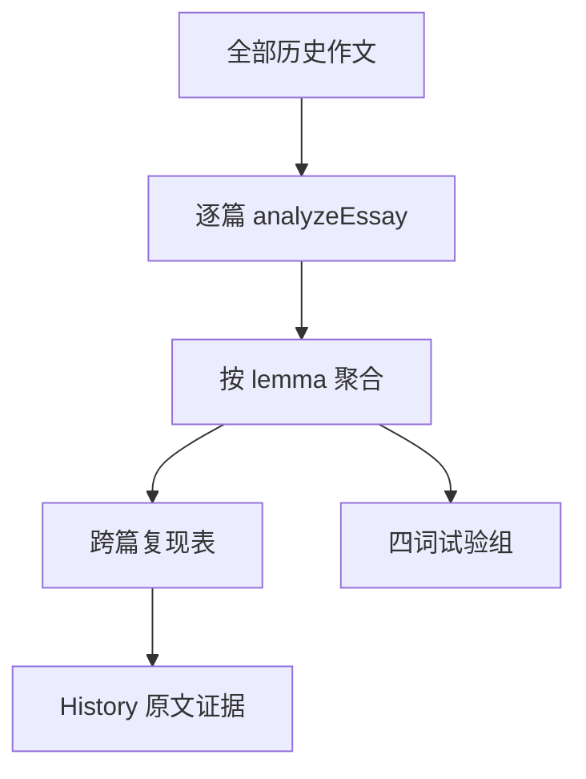

# DEEA v0.3 技术设计（中文）

**状态**：功能已随 PR #6 合并 `main`；五篇样本及验证附录在后续分支，待评审。**日期**：2026-09-23。  
**约束**：Vite / React / TypeScript，原文仍在 `deea.essays.v1` 的浏览器 `localStorage`；无服务器、数据迁移或 AI API。
**关联 PR**：[v0.3 跨篇统计与词组试验 #6](https://github.com/gwx4399-cell/coca-word-frequency-tool/pull/6)。

## 1. 分析管线

`src/analysis/acrossEssays.ts` 新增纯函数 `analyzeAcrossEssays(essays, cocaEntries)`，输入为仓储层已排成最新优先的作文和 COCA lemma Map。它**不读取 DOM、不持久化派生结果**；保存/删除后 `App` 更新 `essays`，React 重新计算。原有 `writingAdvice.ts` 仍单独观察最近三篇。

| 数据结构 | 字段与来源 |
| --- | --- |
| `CrossEssayWord` | `lemma`、`totalCount`、`essayCount`、去重的 `observedForms`、逐篇 `occurrences`。 |
| `AcrossEssayAnalysis.words` | 所有分析得到的 lemma 的完整跨篇统计，包含累计仅 1–2 次的词，供后续规则使用；本版 UI 不直接展示。 |
| `EssayOccurrence` | `essayId`、标题、写作日期、本篇 lemma 次数和 observed forms；保留 ID 以便跳到原文。 |
| `PilotGroup` | 四成员次数与组内 `sharePct`、合计次数、涉及作文数、最高频成员和证据是否充足。 |

每篇的 `analyzeEssay` 已把同一 lemma 聚成一行。跨篇遍历所有行并累计，**不先过滤**本篇 1–2 次的词。完整结果放在 `words`；用于表格的 `repeatedWords` 再筛选：`essayCount >= 2 && totalCount >= 3`；按出现篇数降序、总次数降序、lemma 字母序排序。逐篇列表保持仓储层的日期排序。单篇 UI 另用 `analysis.lemmas.filter(row => row.count >= 3)`，不改 `analyzeEssay` 的结果类型或 COCA 内部字段。

## 2. 试验组规则及反例

固定成员为 `important`、`significant`、`essential`、`crucial`；这些词均在随仓库提供的 COCA 源 CSV 中。四个成员的累计次数相加为 `groupTotal`；每个成员 `sharePct = memberCount / groupTotal × 100`。`groupTotal === 0` 时全部份额为 0，最高频成员为 `null`。仅在 `groupTotal >= 3` 且这些词合计出现于至少两篇时展示比例，否则显示证据不足。若最高频成员份额 >50%，界面只提示回看原句。

**正例**：A 篇 important 3、significant 1；B 篇 important 1、essential 1。总数 6，important 4/6 = 66.7%，组涉及两篇。**反例**：某篇 `good` 出现 5 次，它不属于本试验组，不能算进“重要性”的分母；即便 important 在四词组中占 100%，也不能推断作者在所有“重要性”表达机会中总选它。

这里是**人工词表成员的观测词次占比**，没有语义功能标注或 token 级词性识别；不得把试验词组直接命名为自动识别的意群。试验结果不进入既有写作建议规则，以免未经验证的占比改变反馈。

## 3. 页面、空状态与失败边界

`App.tsx` 增加 `Across essays` 导航和 `AcrossEssaysView`。每行的原文链接把 `selectedEssayId` 设为对应 ID 后打开 History 详情。建议面板仍在共用导航下。跨篇无达标词、试验组不足阈值和单篇无 ≥3 次词各有独立空状态。

现有标题唯一和自动保存逻辑未改；删除作文时仓储层先写回历史，再触发重新计算。数据损坏仍按现有仓储规则回退为空列表。跨篇按当前浏览器的**全部**作文计算：代码没有文体或作者字段；教学场景必须手工保证可比性。当前每次历史变更重算所有作文，适合小规模 Demo；若作文数量扩大，应再评估缓存或增量计算。

## 4. 验证和限制

从项目根目录执行 `npm test`、`npx tsc --noEmit`、`npm run build`。新增测试覆盖 1+1+1 次仍参与跨篇、组内份额、删除重算、零分母、导航到原文；现有测试覆盖单篇隐藏和建议中总次数不足 3 的回退。测试仅使用虚构样例，不提交真实学生作文。

`data/demo/IELTS_TASK2_FIVE_ESSAYS.json` 是五篇原创作文的机器可读输入；对应的 [Markdown 阅读版](../../../data/demo/IELTS_TASK2_FIVE_ESSAYS.md) 供人工逐篇录入。`src/analysis/demoEssays.test.ts` 使用随库 COCA CSV、`analyzeEssay`、`analyzeAcrossEssays` 和 `getWritingAdvice` 验证每篇 ≥250 词、significant 五篇各一次却跨篇累计五次、crucial 累计两次隐藏、四词组 13/25=52.0%、写作建议只看最近三篇。测试样本不写入默认浏览器历史，设计图只展示这五篇是全部历史时的计算值。完整测试现为 **35 个 / 9 个测试文件**。

本次没有目标记录、时间锚点、+1/+3/+5 后测或真正的语义机会分母。下一步应先验证词组的误判与同文体条件，再决定是否扩展意群；不能将本版比例用于自动评价学生。

关联：[PRD 中文](./DEEA_PRD_CN.md) · [产品设计图](./DEEA_PRODUCT_DESIGN_CN.md) · [Technical design English](./DEEA_TECHNICAL_DESIGN_EN.md) · [文档索引](../../README.md)
