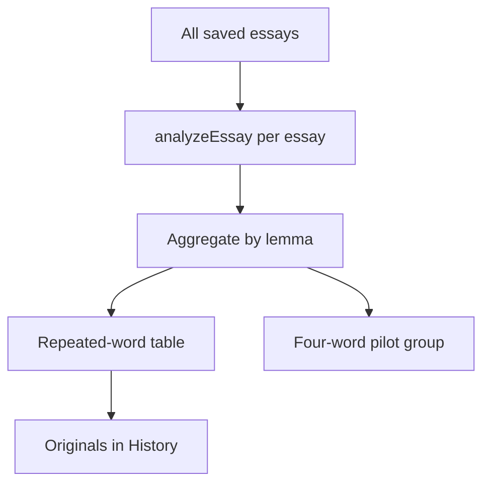

# DEEA v0.3 Technical Design

**Status:** Functionality merged into `main` through PR #6; five-essay fixtures and verification appendix proposed in PR #7, pending review. **Date:** 2026-09-23.  
**Runtime:** Vite / React / TypeScript. Originals remain under the `deea.essays.v1` browser `localStorage` key; no backend, migration or AI API.
**Pull request:** [v0.3 cross-essay analysis and pilot #6](https://github.com/gwx4399-cell/coca-word-frequency-tool/pull/6).
**Sample and design follow-up:** [Five IELTS essays and product design #7](https://github.com/gwx4399-cell/coca-word-frequency-tool/pull/7).

## 1. Analysis flow and contracts

`src/analysis/acrossEssays.ts` exports the pure `analyzeAcrossEssays(essays, cocaEntries)` function. It consumes the repository's newest-first essay records and COCA lemma map. It neither reads the DOM nor stores derived data. `App` recomputes when `essays` changes after save or deletion. Existing `writingAdvice.ts` still analyzes only the latest three essays.

| Contract | Fields and use |
| --- | --- |
| `CrossEssayWord` | lemma, total count, number of essays, deduplicated observed forms and occurrences. |
| `AcrossEssayAnalysis.words` | Full cross-essay results for every analyzed lemma, including total counts of one or two, available to later rules but not shown as standalone UI rows. |
| `EssayOccurrence` | essay ID, title, writing date, count and observed forms. The ID links evidence back to History. |
| `PilotGroup` | four member counts/shares, group total, number of essays with a member, leader and display sufficiency. |

Each `analyzeEssay` result contains one row per lemma. Accumulate **all** rows before filtering; a count of one or two in a single essay can help form a cross-essay total. Keep the unfiltered `words` result for later features; its display subset uses `essayCount >= 2 && totalCount >= 3` and sorts by essay count descending, total count descending, then lemma alphabetically. Per-essay occurrences retain repository order. Separately, the single-essay UI applies `analysis.lemmas.filter(row => row.count >= 3)` without altering the analyzer or its COCA fields.

## 2. Pilot group and counterexamples

The fixed member list is `important`, `significant`, `essential`, `crucial`; each appears in the bundled COCA source. `groupTotal` sums their observed counts; `sharePct = memberCount / groupTotal × 100`. With a zero total, all shares are zero and there is no leader. The page shows a share only when there are at least three group uses across at least two essays. A leader above 50% triggers wording that asks the user to review original sentences.

**Positive calculation:** essay A has important 3 and significant 1; essay B has important 1 and essential 1. Group total is six, so important has a 4/6 = 66.7% share across two essays. **Counterexample:** five uses of `good` do not enter this configured group's denominator. Even a 100% share for important within these four words cannot tell us whether the writer chose it for every opportunity to express importance.

This is the observed-token share of a **manual word set**, not contextual semantic classification. There is no token-level POS disambiguation or count of all meaning-equivalent opportunities. Pilot output does not change the existing writing-advice rules.

## 3. UI, recalculation and limits

`App.tsx` adds the Across essays tab and view. An evidence title sets `selectedEssayId` and opens its History detail. The older three-essay advice panel remains below the shared navigation. Independent empty states cover no repeated word, insufficient group evidence and no word reaching the single-essay threshold.

Auto-save and title uniqueness are unchanged. Deleting a record updates browser storage and recalculates the derived views. Corrupt stored data still follows the repository's existing empty-list fallback. Every essay in the browser is included because there is no author or genre field; users must ensure a comparable corpus. Recomputing all essays when History changes is acceptable for a small demo, but larger datasets would require a performance review.

## 4. Verification and future boundary

From the project root, run `npm test`, `npx tsc --noEmit`, and `npm run build`. New tests cover 1+1+1 occurrences becoming visible across essays, the group denominator, deletion recalculation, the zero case and navigation to the source essay. Existing UI tests cover hidden one-/two-use rows and the advice fallback below three total uses. Fixtures are invented; no real student writing is committed.

`data/demo/IELTS_TASK2_FIVE_ESSAYS.json` is the machine-readable source for five original essays; the [Markdown reading copy](../../../data/demo/IELTS_TASK2_FIVE_ESSAYS.md) supports manual entry. `src/analysis/demoEssays.test.ts` runs the bundled COCA CSV through `analyzeEssay`, `analyzeAcrossEssays` and `getWritingAdvice`: each essay has at least 250 words; significant appears once in each yet totals five across essays; crucial totals two and is hidden from the repeated-word list; the pilot yields 13/25 = 52.0%; advice uses only the latest three. Fixtures are never silently added to browser history, and wireframe values assume that the five are the complete history. The full suite has **35 tests across nine files**.

This release has no stored learning goal, intervention anchor, +1/+3/+5 follow-up state or actual semantic-opportunity denominator. Evaluate group false positives and same-genre conditions before enlarging the inventory or using a share to assess a student.

Related: [Product requirements](./DEEA_PRD_EN.md) · [product wireframe](./DEEA_PRODUCT_DESIGN_EN.md) · [技术设计中文](./DEEA_TECHNICAL_DESIGN_CN.md) · [Documentation index](../../README.md)
