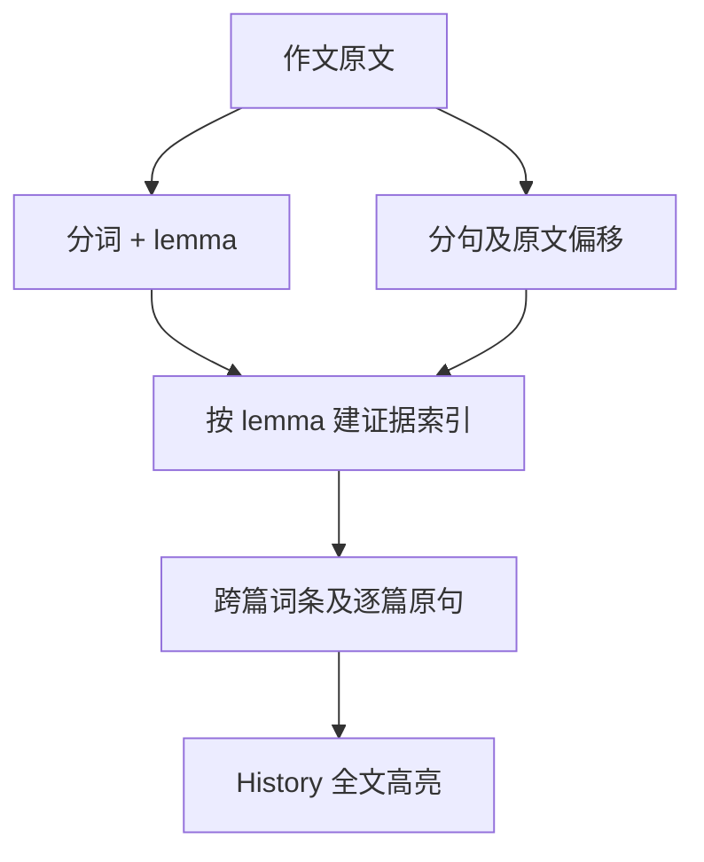

# DEEA v0.4 技术设计（中文）

**状态**：`feature/original-sentence-evidence-v0-4` 分支已实现，待合并。**日期**：2026-09-23。**关联 PR**：[原句高亮 #9](https://github.com/gwx4399-cell/coca-word-frequency-tool/pull/9)。无存储迁移、无外部服务或 AI 模型。

## 数据流与契约

`tokenize(text)` 现在为每个 token 增加原文起止偏移 `start/end`，原有 `surface/normalized` 规则不变。`src/analysis/evidence.ts` 使用同一个 `lemmatizeWord` 与停用词集合构建 `Map<lemma, SentenceEvidence[]>`。`SentenceEvidence` 包括原句起点、原句原文，以及相对于原句的多个匹配区间。`analyzeAcrossEssays` 对每篇作文只建立一次句子索引，把对应证据附到该 lemma 的 `EssayOccurrence.sentences`；UI 仍在跨篇汇总后才按「至少两篇且累计三次」过滤显示。

选中词的句子在折叠证据内展示；点击标题时，`App` 保存作文 ID 与来源 lemma，History 用 `findLemmaMatches` 在原文中重算匹配区间。普通 History 导航清除来源 lemma。`HighlightedText` 使用 React 文本节点与 `<mark>` 渲染原文切片，**不注入 HTML**。因此包含尖括号的作文也作为文本显示。

## 精确规则、回退与反例

- 匹配依据是**完整 token 的 lemma 相等**。`use / used / using` 按现有规则映射到 `use`；`useful` 不算 `use`，`us` 是停用词。重复词形按出现位置逐一标注，同一句出现两次就产生两个匹配区间。
- 英文句界以 `. ! ?`（可含结尾引号）后接空白或正文结束来判断；没有结尾标点的尾段仍是原句。分句仅用于展示，不改变计数；例如 `Dr. Smith` 可能拆成较短片段，全文仍按原样可查。
- 一个跨篇词在某篇出现一次，也得到那一句证据。现有存储仅保存作文原文；句子索引在界面计算，不需要更改 `deea.essays.v1`。删除后重算，避免失效引用。
- 无可显示的跨篇词继续使用已有空状态；组内观察次数不足时不显示比例。若后续发现计数与区间不符应以原文、分词规则和测试定位问题，不据高亮自动判定语言质量。

## 文件与验证

| 文件 | 职责 |
| --- | --- |
| `src/types/analysis.ts`、`src/analysis/tokenize.ts` | token 保留原文起止位置；不修改现有 token 数与 lemma 选择。 |
| `src/analysis/evidence.ts` | 生成逐句证据和全文 lemma 匹配区间。 |
| `src/analysis/acrossEssays.ts` | 在原有逐篇计数旁挂载原句列表。 |
| `src/App.tsx`、`src/style.css` | 折叠证据内逐句高亮；点击 History 后全文高亮与清除状态。 |
| `src/analysis/evidence.test.ts`、`src/App.across.test.tsx`、`src/analysis/demoEssays.test.ts` | 校验变形词、子串反例、同句多次、跳转及五篇测试作文的计数一致性。 |

项目根目录运行 `npm test`、`npx tsc --noEmit`、`npm run build`。虚构样本可复现软件行为，尚未测试教师是否更快、更准确地核查句子。

相关：[PRD 中文](./DEEA_PRD_CN.md) · [Technical design English](./DEEA_TECHNICAL_DESIGN_EN.md) · [产品设计图](./DEEA_EVIDENCE_DESIGN.svg)。
