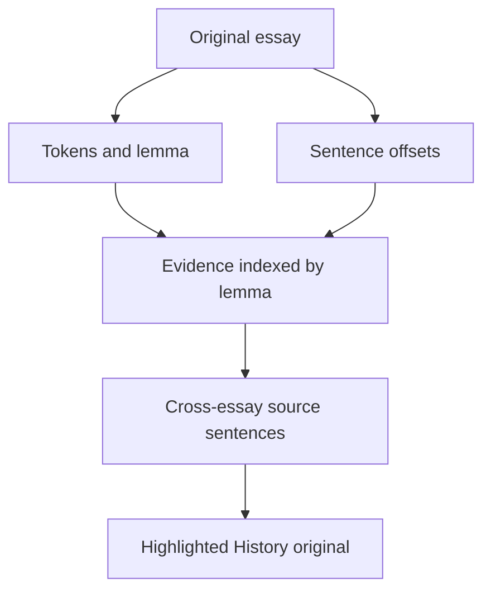

# DEEA v0.4 Technical Design

**Status:** Implemented on `feature/original-sentence-evidence-v0-4`, pending merge. **Date:** 2026-09-23. **Pull request:** [Original sentence evidence #9](https://github.com/gwx4399-cell/coca-word-frequency-tool/pull/9). No storage migration, external service or AI model.

## Data flow and types

`tokenize(text)` now provides source-text `start/end` offsets for every token without changing its surface or normalized forms. `src/analysis/evidence.ts` uses the same `lemmatizeWord` and stop-word set to build a `Map<lemma, SentenceEvidence[]>`. Each `SentenceEvidence` retains the original sentence start, exact text and an array of match ranges relative to that sentence. `analyzeAcrossEssays` builds an index once per essay and adds it to `EssayOccurrence.sentences`. It filters visible cross-essay words only after aggregation, with the existing threshold of at least two essays and three total uses.

Expanded evidence renders the sentences for the selected word. Selecting a title stores its essay ID and source lemma in `App`; History uses `findLemmaMatches` to recalculate whole-text ranges. Normal History navigation clears the source lemma. `HighlightedText` renders substrings as React text nodes and `<mark>` elements, never as injected HTML. User prose containing angle brackets therefore stays literal text.

## Matching, fallback and counterexamples

- Match a **whole token by its derived lemma**. Existing overrides group `use / used / using`; `useful` is not `use`, and `us` is a stop word. Multiple occurrences in one sentence receive separate ranges.
- A lightweight boundary rule splits after `. ! ?` (including a trailing quotation mark) when followed by whitespace or the end; an unfinished final sentence is also retained. This does not change word counts. Abbreviations such as `Dr. Smith` can yield short excerpts; the intact full original remains available in History.
- An individual use hidden in the single-essay table still has source evidence once its aggregate word appears across essays. Only original essay records are stored under `deea.essays.v1`; sentence indexes are derived when rendering and rebuilt after deletion.
- Existing empty states and pilot-group thresholds remain. The app makes no language-quality claim from a highlighted form.

## Files and checks

| File | Responsibility |
| --- | --- |
| `src/types/analysis.ts`, `src/analysis/tokenize.ts` | Preserve source offsets alongside existing token fields. |
| `src/analysis/evidence.ts` | Index original sentences and locate whole-text lemma matches. |
| `src/analysis/acrossEssays.ts` | Add source sentences to existing per-essay occurrences. |
| `src/App.tsx`, `src/style.css` | Show highlighted evidence and full text; clear contextual highlight on normal navigation. |
| `src/analysis/evidence.test.ts`, `src/App.across.test.tsx`, `src/analysis/demoEssays.test.ts` | Verify inflections, substring counterexamples, multiple matches, source navigation and count consistency with the five sample essays. |

Run `npm test`, `npx tsc --noEmit` and `npm run build` at project root. These fictional fixtures verify software rules, not the speed or validity of teachers' decisions.

Related: [Product requirements](./DEEA_PRD_EN.md) · [技术设计中文](./DEEA_TECHNICAL_DESIGN_CN.md) · [evidence design drawing](./DEEA_EVIDENCE_DESIGN.svg).
